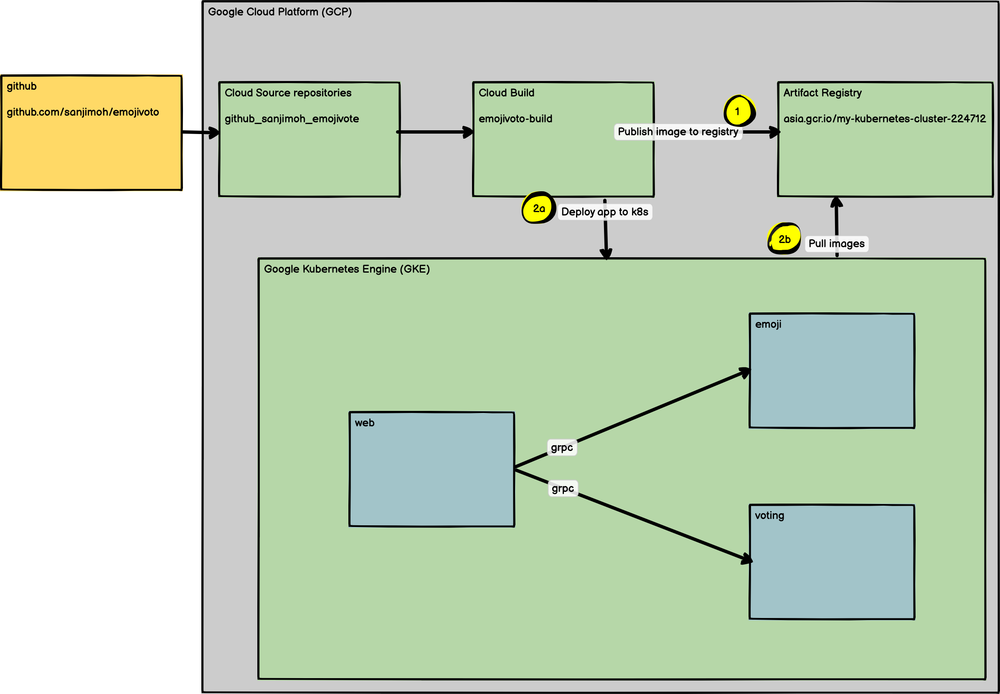

# Emoji.vote

A microservice application that allows users to vote for their favorite emoji,
and tracks votes received on a leaderboard. May the best emoji win.
 
The application is composed of the following 3 services:

* [emojivote-web](emojivote-web/): Web frontend and REST API
* [emojivote-emoji-svc](emojivoto-emoji-svc/): gRPC API for finding and listing emoji
* [emojivote-voting-svc](emojivoto-voting-svc/): gRPC API for voting and leaderboard



## Local Development

### Emojivote webapp

This app is written with React and bundled with webpack.
Use the following to run the emojivote go services and develop on the frontend.

Set up proto files, build apps

```bash
make build
```

Start the voting service

```bash
GRPC_PORT=8081 go run emojivoto-voting-svc/cmd/server.go
```

[In a separate terminal window] Start the emoji service

```bash
GRPC_PORT=8082 go run emojivoto-emoji-svc/cmd/server.go
```

[In a separate terminal window] Bundle the frontend assets

```bash
cd emojivote-web/webapp
yarn install
yarn webpack # one time asset-bundling OR
yarn webpack-dev-server --port 8083 # bundle/serve reloading assets
```

[In a separate terminal window] Start the web service

```bash
export WEB_PORT=8080
export VOTINGSVC_HOST=localhost:8081
export EMOJISVC_HOST=localhost:8082

# if you ran yarn webpack
export INDEX_BUNDLE=emojivoto-web/webapp/dist/index_bundle.js

# if you ran yarn webpack-dev-server
export WEBPACK_DEV_SERVER=http://localhost:8083

# start the webserver
go run emojivoto-web/cmd/server.go
```

[Optional] Start the vote bot for automatic traffic generation.

```bash
export WEB_HOST=localhost:8080
go run emojivoto-web/cmd/vote-bot/main.go
```

View emojivote

```bash
open http://localhost:8080
```
