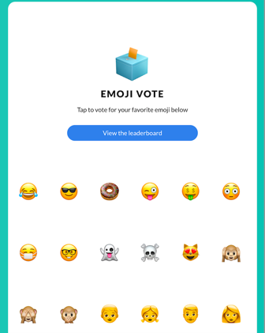

# Emoji vote application

A microservice application that allows users to vote for their favorite emoji,
and tracks votes received on a leaderboard. May the best emoji win.

Intention of this sample application is to quickly onboard on GCP CI/CD pipeline with some meaningful and practical
input.
 
The application is composed of the following 3 services:

* [emojivoto-web](emojivoto-web/): Web frontend and REST API
* [emojivoto-emoji-svc](emojivoto-emoji-svc/): gRPC API for finding and listing emoji
* [emojivoto-voting-svc](emojivoto-voting-svc/): gRPC API for voting and leaderboard

